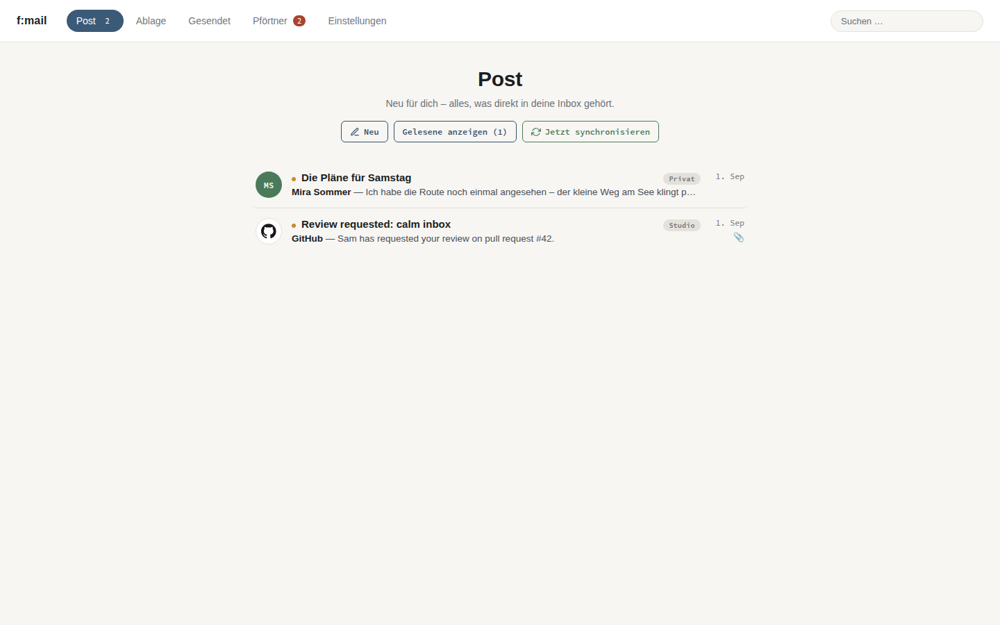
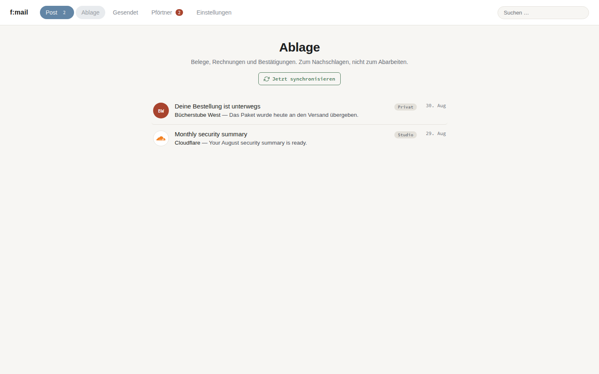
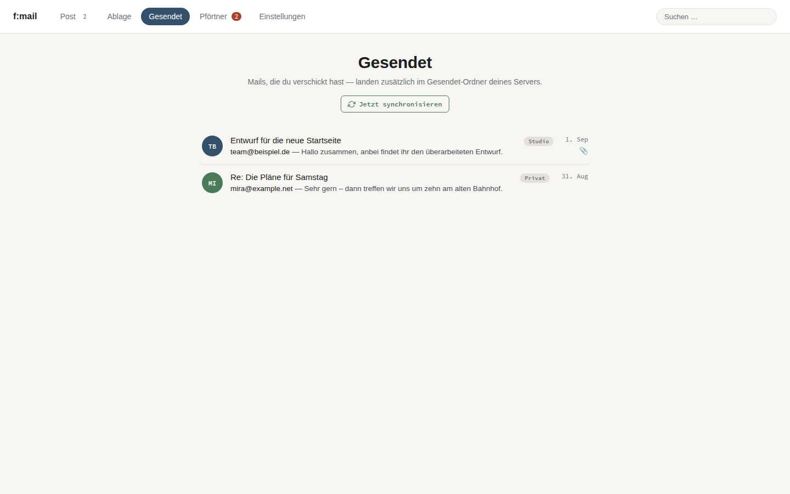
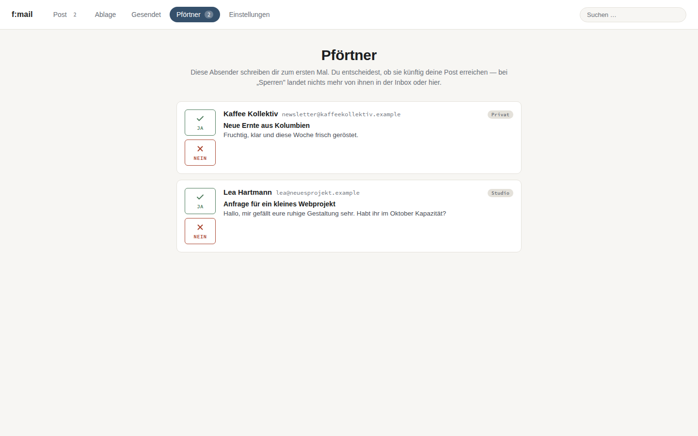
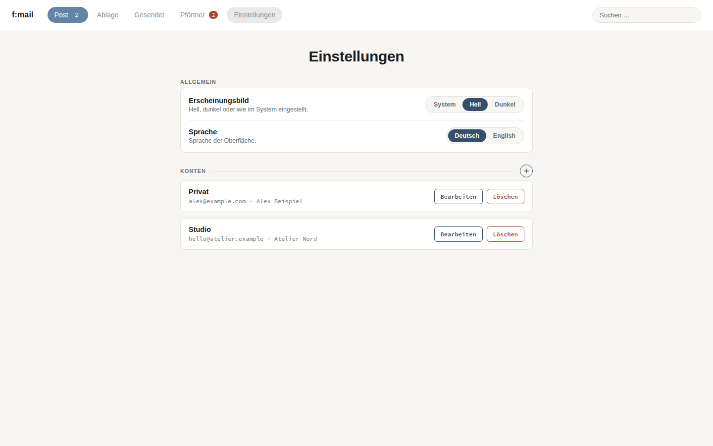
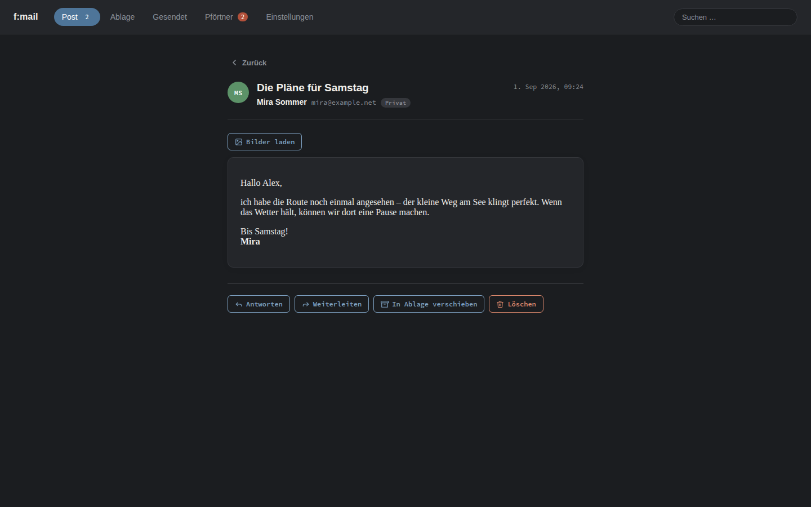

# f:mail

f:mail is for me and my needs, make it yours

Ein ruhiger, lokaler Mailclient für Linux: Go, Wails 3, IMAP/SMTP mit
erzwungenem TLS, SQLite und Passwörter im Schlüsselbund des Betriebssystems.



## Ansichten

| | |
|---|---|
| Post |  |
| Ablage |  |
| Gesendet |  |
| Pförtner |  |
| Einstellungen |  |
| Mail im Darkmode |  |

Alle Screenshots entstehen im eingebauten, ausschließlich über `?demo=1`
aktivierten Demo-Modus. Die Namen, Inhalte und `example.*`-Adressen sind
erfunden; der Modus greift weder auf die lokale Datenbank noch auf Konten zu.

## Was f:mail kann

- gemeinsamer Posteingang für mehrere Konten
- Pförtner für unbekannte Absender: freigeben oder dauerhaft blockieren
- Post, Ablage und serverseitiger Gesendet-Ordner
- Antworten, Weiterleiten, HTML-Verfassen und Anhänge
- serverseitiges Verschieben in den Papierkorb beim Löschen
- Hell-, Dunkel- und Systemdarstellung; Deutsch und Englisch
- Zugangsdaten im Secret Service/KWallet/GNOME Keyring statt in SQLite

## Lokal bauen

Benötigt werden Go 1.25, Node.js 20+, die Linux-Abhängigkeiten von Wails 3
und die zur App passende CLI-Version:

```bash
go install github.com/wailsapp/wails/v3/cmd/wails3@v3.0.0-beta.9
cd fmail/frontend
npm ci
npm run build
cd ..
go mod verify
go test ./...
wails3 build -tags gtk3
```

Auf Distributionen mit WebKitGTK 6 kann `-tags gtk3` entfallen. Die GitHub
Action baut denselben eingecheckten Quellstand und verwendet die Lockfiles;
es wird kein separates Projektgerüst mehr dynamisch erzeugt.

## Flatpak installieren

Das Flatpak wird ausschließlich über GitHub veröffentlicht, nicht über
Flathub. Ein Release-Bundle lässt sich so installieren:

```bash
flatpak install --user ./fmail.flatpak
flatpak run digital.franky.Fmail
```

Jeder Commit auf `main` erzeugt ein kurzlebiges CI-Artefakt. Ein Tag wie
`v0.1.0` veröffentlicht das Linux-Binary und `fmail.flatpak` dauerhaft unter
[GitHub Releases](https://github.com/franky-dot-digital/fmail/releases).

## Docker-Demo

```bash
docker compose -f docker-compose.novnc.yml up --build
```

Danach `http://localhost:6080/vnc.html` öffnen. Der Schlüsselbund im Container
ist nur ein Best-Effort-Testdienst; persönliche Konten besser nativ verwenden.

## Daten und Sicherheit

Die Maildatenbank liegt unter `~/.config/fmail/fmail.db`, das Verzeichnis wird
mit `0700`, die Datei mit `0600` geschützt. Der Inhalt der Datenbank ist nicht
zusätzlich verschlüsselt; für gespeicherte Mails wird daher
Festplattenverschlüsselung (z. B. LUKS) empfohlen. Details, Audit-Ergebnisse
und verbleibende Grenzen stehen in [SECURITY.md](SECURITY.md).

## Struktur

```text
fmail/                    kanonischer, baubarer Quellcode
  accountservice.go       Konten, Schlüsselbund, Synchronisation
  mailservice.go          Ansichten, Aktionen, Versand
  internal/mail/          IMAP, SMTP, MIME und HTML-Sanitisierung
  internal/store/         SQLite-Schema und Migrationen
  frontend/               Vanilla HTML/CSS/JavaScript
digital.franky.Fmail.yml  Flatpak-Buildmanifest
flatpak/                  Desktop-Datei, AppStream-Metadaten und Icon
docs/screenshots/         reproduzierbare Screenshots mit Demodaten
.github/workflows/        Tests, Audit und Linux-/Flatpak-Build
```

## Lizenz

[MIT](LICENSE) – passend zur bereits in den AppStream-Metadaten deklarierten
Projektlizenz.
